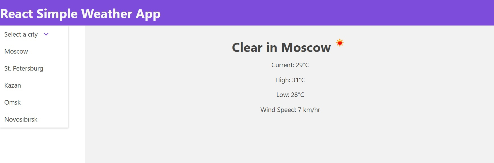

"# React-Weather-App"

**This application takes the API from the open weather site, and gives us the city we have chosen.**

The application is made with React.js and grommet.

The final view of the application **->**

